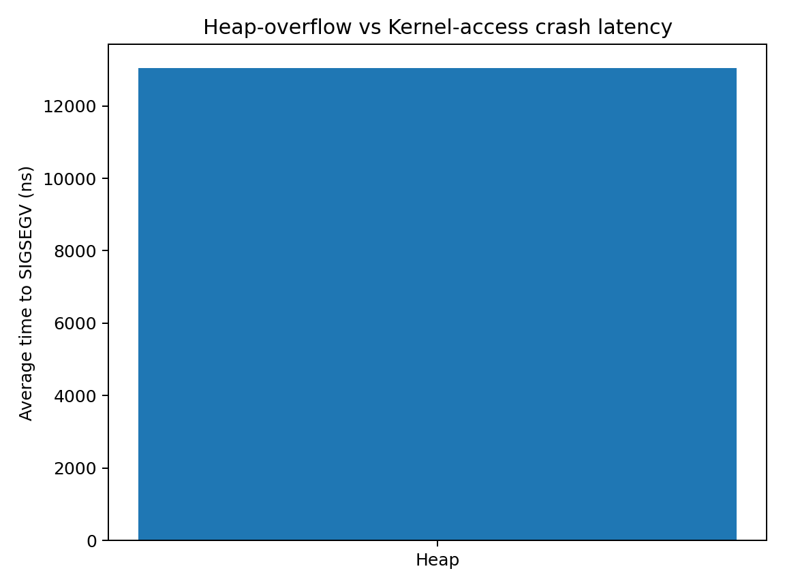

# 🔒 Memory‑Crash Playground

Small C++17 project that **intentionally crashes** in two different ways and measures how long it takes:

| Test   | Action                                                            | Result |
|--------|-------------------------------------------------------------------|--------|
| **Heap**   | Allocate *N* bytes, write *M* bytes past the end → hit guard page | `SIGSEGV` |
| **Kernel** | Write to a supervisor‑only virtual address (`0xFFFF…`)         | `SIGSEGV` |

Command‑line parsing uses the header‑only **[Kaizen (Zen)](https://github.com/heinsaar/kaizen)** library.

---

## 📂 Directory layout

```
.
├── kernel_access.h / .cpp      # Kernel‑space poke
├── heap_overflow.h  / .cpp     # Heap‑overflow demo
├── main.cpp                    # Test‑driver with Zen argument parsing
├── Makefile                    # Build / run / plot targets
├── plot_results.py             # Quick matplotlib visualisation
└── kaizen                      # (single‑header library clone)
```

---

## ⚙️ Build

```bash

# 1) Compile everything (debug, no optimisation so crashes are clearer)
make
```

Produces the executable **`mem_crash_tests`**.

---

## ▶️ Run tests

```bash
# Default: both tests, 3 trials each
./mem_crash_tests --test both --trials 3

# Heap only – custom allocation & overrun
./mem_crash_tests --test heap --alloc 64 --overrun 4096 --trials 5

# Kernel only – alternate address
./mem_crash_tests --test kernel --addr FFFF800000000000 --trials 4
```

Each run appends to **`mem_crash_results.csv`**  
and prints a Markdown summary table, e.g.

```
| Test   | Avg time (ns) | Trials | SIGSEGVs |
|--------|--------------:|-------:|---------:|
| Heap   |     123 456   |     3  |      3   |
| Kernel |   7 890 123   |     3  |      3   |
```

---

## 📈 Visualise results

```bash
make plot
```

*Runs `plot_results.py`* → reads `mem_crash_results.csv`, computes averages, and saves **`mem_crash_plot.png`**.



*(Your bars will differ — higher bar ⇒ loop survived longer before crashing.)*

---

## 🧐 Why can’t user programs touch kernel memory?

* **Privilege rings** – user code runs in Ring 3; kernel pages are marked supervisor‑only (`U/S = 0` in page tables).
* **MMU enforcement** – any Ring 3 load/store to such a page raises a hardware page‑fault *before* it reaches DRAM.
* **Guard pages** – allocators leave an unmapped page after heap blocks, so overruns are caught instantly.
* The kernel converts the page‑fault into signal `SIGSEGV`, terminating the offender.

---

## 🧹 Clean up

```bash
make clean
```

Removes the binary, object files, CSV, and plot PNG.

---

### ⚠️ Disclaimer

This project **must crash**.  
Run it only in a disposable environment, never as `root`, and not on production systems.